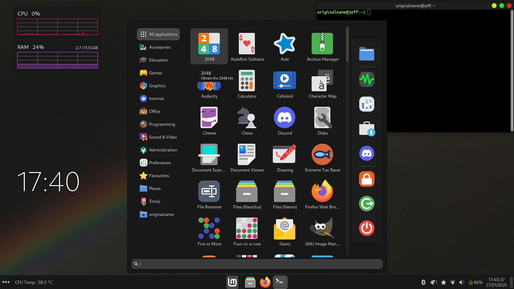

# blackmint

# Description
A curved, modernised theme for the cinnamon desktop based on Mint-Y
There is also a matching gtk3 theme, but gtk2 and gtk4 themes need to be developed
# How to install/use:
 - Make sure that the desktop environment that you are using is cinnamon. 
 - Download the repo or clone it using the command `git clone https://github.com.originalnamegoeshere/blackmint`.
 - Rename the `src` folder to blackmint. 
 - Cut and paste the `src` folder to the directory  `/usr/share/themes/` as root (You can do this by going into terminal and typing `sudo nemo` if you are using cinnamon). 
 - You should be able to go into settings and change the theme to blackmint. NOTE: it will not be available in the "simplified settings" and you will have to click on "advanced settings". 
